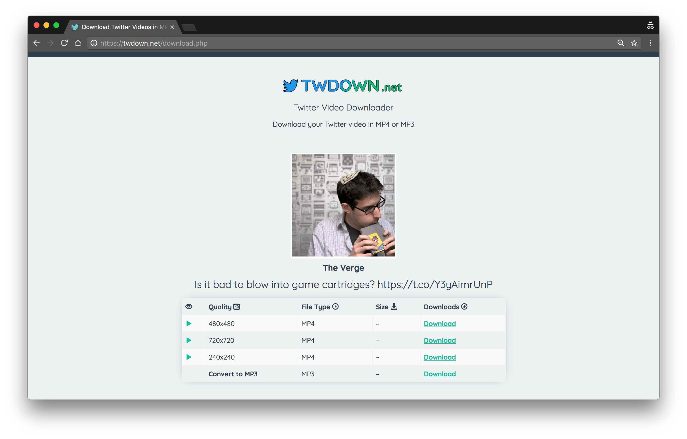

# twdown


[](https://travis-ci.org/Kikobeats/twdown)
[](https://david-dm.org/Kikobeats/twdown)
[](https://david-dm.org/Kikobeats/twdown#info=devDependencies)
[](https://www.npmjs.org/package/twdown)
[](https://paypal.me/Kikobeats)



It converts [twdown.net](https://twdown.net/) website into data

```js
[
  {
    ext: 'mp4',
    height: 480,
    protocol: 'https',
    size: '480x480',
    url: 'https://video.twimg.com/amplify_video/943561675927519232/vid/480x480/qURzB_XtWBE-dvRa.mp4',
    width: 480
  }, {
    ext: 'mp4',
    height: 720,
    protocol: 'https',
    size: '720x720',
    url: 'https://video.twimg.com/amplify_video/943561675927519232/vid/720x720/h1uN7biCI-Fbzm9D.mp4',
    width: 720
  }, {
    ext: 'mp4',
    height: 240,
    protocol: 'https',
    size: '240x240',
    url: 'https://video.twimg.com/amplify_video/943561675927519232/vid/240x240/mijiQdCq-p9FaO8H.mp4',
    width: 240
  }, {
    ext: 'mp3',
    protocol: 'https',
    url: 'https://twdown.net/mp3.php?v=NHBtLkQ5bXpiRi1JQ2liN051MWgvMDI3eDAyNy9kaXYvMjMyOTE1NzI5NTc2MTY1MzQ5L29lZGl2X3lmaWxwbWEvbW9jLmdtaXd0Lm9lZGl2Ly86c3B0dGg=&t=token%260c05c632a2822a0a877c7e991602543'
  }
]
```

## Install

> NOTE: It needs to pass a [browserless](https://browserless.js.org) instance.

```bash
$ npm install twdown --save
```

## Usage

```js
const twdown = require('twdown')
const browserless = require('browserless')()

;(async () => {
  const videos = await twdown({
    url: 'https://twitter.com/verge/status/957383241714970624',
    browserless
  })()

  console.log(videos)
  // [
  //   {
  //     ext: 'mp4',
  //     height: 480,
  //     protocol: 'https',
  //     size: '480x480',
  //     url: 'https://video.twimg.com/amplify_video/943561675927519232/vid/480x480/qURzB_XtWBE-dvRa.mp4',
  //     width: 480,
  //   },
  //   …
  // ]
})()
```

## License

**twdown** © [Kiko Beats](https://kikobeats.com), released under the [MIT](https://github.com/Kikobeats/twdown/blob/master/LICENSE.md) License.<br>
Authored and maintained by Kiko Beats with help from [contributors](https://github.com/Kikobeats/twdown/contributors).

> [kikobeats.com](https://kikobeats.com) · GitHub [Kiko Beats](https://github.com/Kikobeats) · Twitter [@Kikobeats](https://twitter.com/Kikobeats)
